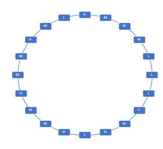

# Norm Evolution

This library is used to ascertain how norms evolve using bottom-up approach when agents decide what strategy to follow based upon their interactions with other agents in the neighbourhood over a period of time.
## How to use it?


```bash
  # Install
  pip install norm-evolution
  
  # Import
  from norm_evolution import simulation

  # Execute 
  simulation.simulation_function_neighbors(seed=1578,
                                  num_agents=20,
                                  radius=2,
                                  iteration_name='test',
                                  num_strategy = 3,
                                  num_initial_possibilities = 10,
                                  time_period=10,
                                  percent_share=[0.4,0.4,0.2],
                                  strategy_pair={0: "H",1: "M",2: "L"},
                                  payoff_values= [[0,0,70],[0,50,50],[30,30,30]],
                                  path_to_save_output = 'C:\\Users\\Downloads\\'
                                 )


```
    
## Function parameters
This library has one function simulation_function_neighbors. Below are the parameters which are required to be specified. At the end in the parenthesis, it shows the data type of the parameter which is required.

1. seed : Any random seed. (Integer)
2. num_agents : Number of agents. (Integer)
3. radius : Agents neighbourhood size. E.g., if its value is set to 1 then each agent will consider 1 agent towards the left and 1 towards the right while deciding what action to take at any given point. (Integer)
4. iteration_name: Provide any name for this iteration. (String)
5. num_strategy : Total number of strategies. (Integer)
6. num_initial_possibilities: Number of possibilities to consider with which the game is started. This implies the count of distinct strategy distribution among agents which we want to consider. (Integer)
7. time_period. How long the game should run. (Integer)
8. percent_share. Percent distribution of strategies among agents. E.g.[0.4,0.4,0.2]. These numbers must add up to 1. Specify in the order of strategies 0,1,2, and so on. (List)	
9. strategy_pair. Strategy pair. E.g. {0: "H",1: "M",2: "L"}. 0 strategy is 'H', 1 strategy is 'M', and 2 strategy is ‘L’. Count must match with num_strategy argument. Keys would need to be 0,1,2, etc. Value corresponding to keys can be anything in string format. (Dictionary)
10. payoff_values. List of payoff values. E.g. [[0,0,70],[0,50,50],[30,30,30]]. The first list [0,0,70] is the first row of the 3*3 payoff matrix assuming we have 3 strategies. Second list [0,50,50] is the second row of the payoff matrix and third list [30,30,30] is the third row of payoff matrix. (List)
It looks something like below

    [0,0,70
     0,50,50
    30,30,30]
11.path_to_save_output. The location where output excel files should be saved. (String)


## Function explanation
We explain the underlying functioning of this library with the help of an example. But this can be replicated to any symmetric game wherein we have defined finite strategies along with its payoff values.

We assume there is a Nash demand game wherein each agent can make 3 demands, High (70), Medium (50) or Low (30). The rule of the game is if the total demands made by two agents in any given iteration are more than 100, no one is going to get anything. Below is the payoff matrix of row versus column player looks like.

	      H	      M	       L
    H	(0,0)	(0,0)	 (70,30)
    M	(0,0)	(50,50)	 (50,30)
    L	(30,70)	(30,50)	 (30,30)

There are 3 pure strategy Nash equilibria, (H, L), (M, M) and (L, H). There is not a strictly or weakly dominant strategy for any of the row or column player. We assume a circular network wherein each agent is connected with two other agents, one on the left and one on the right like in below image.
    

Agents update their strategy if any of their neighbours (defined by radius) are having higher payoff else, they stick to their own strategy which they have been following. Payoffs are computed as follows. If agent with strategy H meets agent with strategy M and L, then payoff from meeting with strategy M agent equals 0 and payoff from meeting with strategy L agent equals 70, hence the total payoff equals 70. In case of a tie, meaning payoffs are exactly same following current strategy versus payoffs from neighbours’ strategy then agents select their strategy randomly. 

We assume agents are distributed in a specific ratio in a circular network. E.g., if total agents (num_agents) are 20 and if they are distributed in 40/40/20 distribution (percent_share), that implies there are 8 H type agents, 8 M type agents and 4 L type agents. This can be represented in a list format like this [H,H,H,H,H,H,H,H,M,M,M,M,M,M,M,M,L,L,L,L]. If we require to rearrange the elements in this list it can be done in approximately (20! / (8!* 8!* 4!)) 62.3 million ways which is a very high number. Hence, we require to specify how many of these different possibilities which we want to consider. The num_initial_possibilities parameter sets this parameter. If its value is 10, the function selects 10 random possibilities out of these total 62.3 million possibilities. These 10 possibilities represent different initial states with which the game would be started. All these 10 possibilities satisfy the constraint of 8 H type agents, 8 M type agents and 4 L type agents. We are interested in knowing how this initial distribution of H/M/L distribution changes as agents allow to interact over a period of time and update their strategy. And how these results change when agents start the game with different initial states (e.g. more H type agents placed with H types or more H type agents placed with M type etc.). The strategy which has higher % of adoption by the end of the game is a potential candidate of a norm.


## How to interpret output?
There are two excel output files which get generated.

    timperiod_data_test_2022-06-28-19-37-04.xlsx
    OriginalPercentdistribution_data_test_2022-06-28-19-37-04.xlsx

The ‘OriginalPercentdistribution’ file is the parameters file which we specify in the function.
The other file has the structure ‘timeperiod’ followed by ‘data’, ‘iteration_name’ and timestamp. Column ‘starting_position’ is the initial position of the agents. ‘count’ and ‘percent_count’ represent how many times different strategy appears at different time periods (timeperiod_number) during the game against different initial states.


